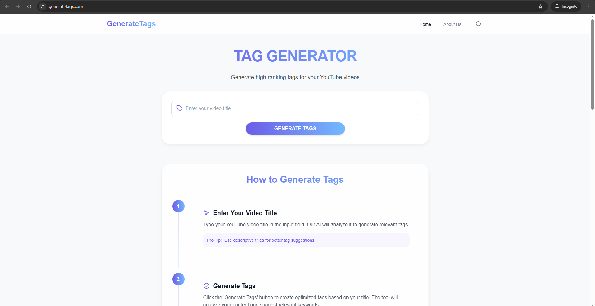

# GenerateTags 🏷️  

🚀 **Free YouTube Tag Generator** – Boost your video rankings with AI-powered, high-ranking tags!  

  

## Features ✨  

- **Instant Tag Generation** – Enter your video title and get optimized tags in seconds.  
- **No Sign-Up Needed** – Completely free, no login required.  
- **Copy & Download** – One-click copy or download tags as a `.txt` file.  
- **Unlimited Resets** – Generate new tags anytime for different variations.  
- **AI-Powered Suggestions** – Targets high-ranking keywords (e.g., "how to make money 2025").  

## How It Works 🛠️  

1. **Enter Your Video Title**  
   - Type your YouTube video title (e.g., *"How to Make Money Online 2025"*).  
2. **Click "Generate Tags"**  
   - Our AI analyzes your title and suggests trending tags (e.g., `money guide (mig)`, `make tips (mig)`).  
3. **Copy or Download**  
   - Use the tags directly or download them for later.  

  
*(Example: Tag generation interface)*  

## Why Use GenerateTags? 💡  

- ✅ **Improve SEO** – Rank higher with relevant, search-friendly tags.  
- ✅ **Save Time** – No manual research; let AI do the work.  
- ✅ **100% Free** – No hidden costs or subscriptions.  

## Try It Now!  

🔗 **[GenerateTags.com](https://generatetags.com)**  

## Contributing 🤝  

Found a bug or have a feature request? Open an [Issue](https://github.com/your-repo/issues) or submit a PR!  

## License  

MIT © [HRP33](https://github.com/HRP33)  
